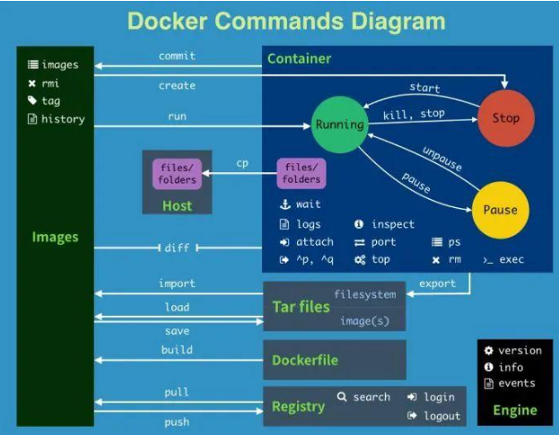
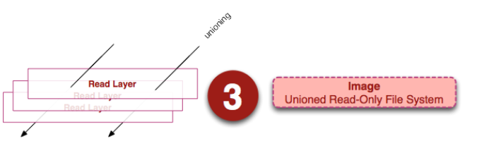
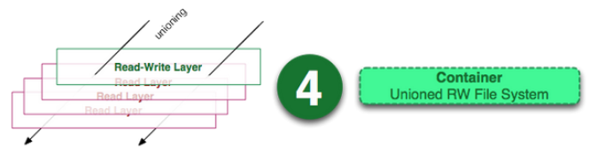
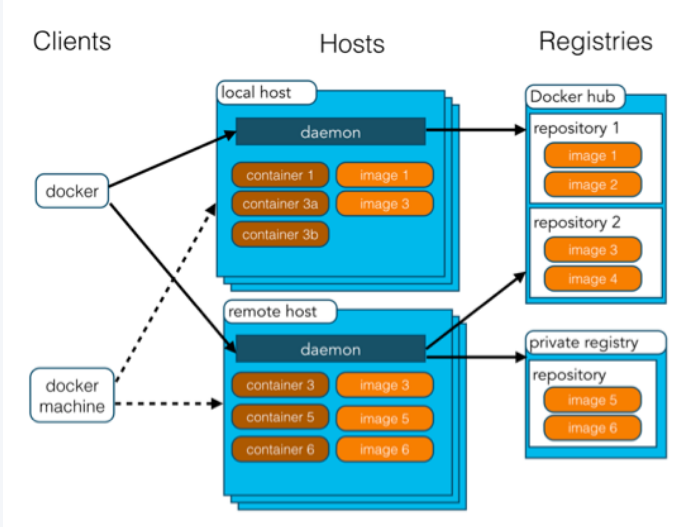
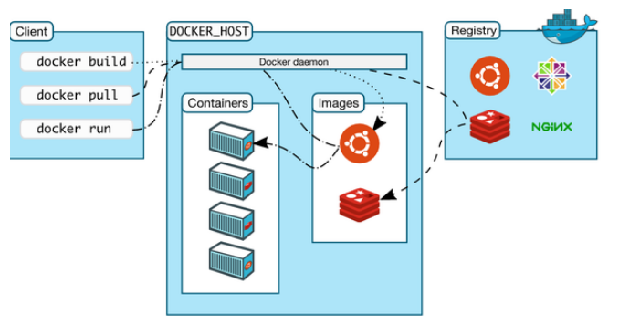
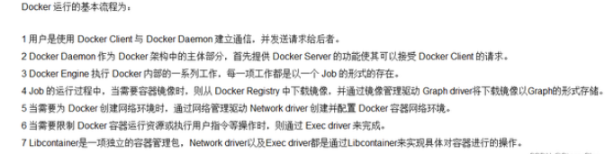
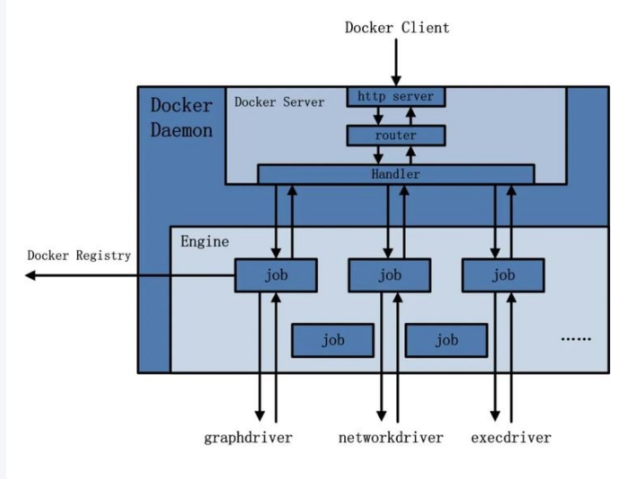
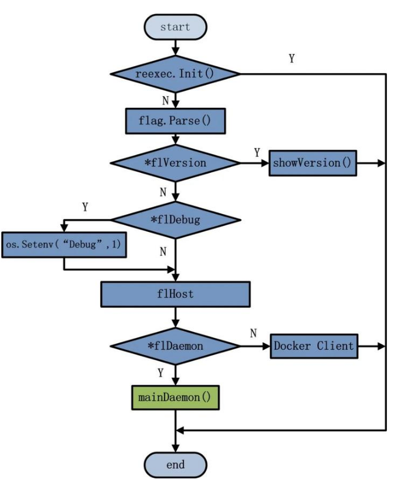

---
title: "note"
draft: true
categories:
    - unarchives
tags:
    - draft
------

image container repository

1. image

> 那么镜像到底是什么呢？Docker 镜像可以看作是一个特殊的文件系统，除了提供容器运行时所需的程序、库、资源、配置等文件外，还包含了一些为运行时准备的一些配置参数（如匿名卷、环境变量、用户等）

2. Container（容器）
> 容器（Container）的定义和镜像（Image）几乎一模一样，也是一堆层的统一视角，唯一区别在于容器的最上面那一层是可读可写的。

3. Repository（仓库）

> Docker 仓库是集中存放镜像文件的场所。镜像构建完成后，可以很容易的在当前宿主上运行。但是， 如果需要在其他服务器上使用这个镜像，我们就需要一个集中的存储、分发镜像的服务，Docker Registry（仓库注册服务器）就是这样的服务。有时候会把仓库（Repository）和仓库注册服务器（Registry）混为一谈，并不严格区分。

>仓库又可以分为两种形式：Public（公有仓库）Private（私有仓库）Docker Registry 公有仓库是开放给用户使用、允许用户管理镜像的 Registry 服务。一般这类公开服务允许用户免费上传、下载公开的镜像，并可能提供收费服务供用户管理私有镜像。除了使用公开服务外，用户还可以在本地搭建私有 Docker Registry。Docker 官方提供了 Docker Registry 镜像，可以直接使用做为私有 Registry 服务。

#### architecture

Docker 的核心组件包括：

Docker Client
Docker Daemon
Docker Image
Docker Registry
Docker Container

Docker Client

简单来说就是CLI，可以构建、运行、停止运用程序，还可以远程和Docker_Host进行交互。
最常用的Docker客户端就是`docker`命令

Docker Daemon

Docker Daemon是服务器组件，在Linux上以守护进程的形式运行，也是Docker的核心。
Docker Daemon 可以认为是通过 Docker Server 模块接受 Docker Client 的请求，并在 Engine 中处理请求，然后根据请求类型，创建出指定的 Job 并运行。Docker Daemon 运行在 Docker Host 上，负责创建、运行、监控容器，构建、存储镜像。

以下是Docker Daemon的架构图

运行过程的作用有以下几种可能：

向 Docker Registry 获取镜像。
通过 GraphDriver 执行容器镜像的本地化操作。
通过 NetworkDriver 执行容器网络环境的配置。
通过 ExecDriver 执行容器内部运行的执行工作。

链接：https://zhuanlan.zhihu.com/p/600034612