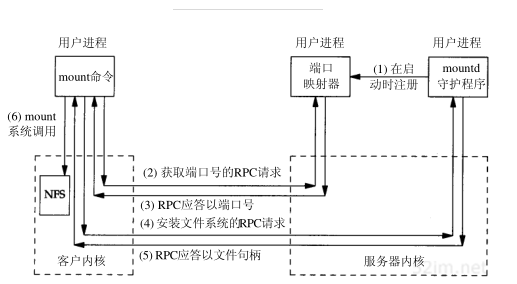

# NFS

## 背景

<p>NFS（Network FileSystem）是在工作中搭建多机共享目录所使用的一个机制。在使用过程中，只是模糊的了解了一下其背后的机制，如果后续有继续学习的话，则会基于当前内容加以跟新完善。</p>

所以目前的内容主要是集中在简单的过一下他的机制，具体的操作步骤是什么样的，还有自己遇到的一丢丢问题。但实际的介绍过程会先演示一下整个操作过程，之后再去解释这些过程的内容以及机制。

## 过程

1. 首先是介绍一下演示环境，两台主机都是Linux系统，彼此之间在同一个网段内部，一个是基于arm的架构，另一个是基于x86的架构。其中文件本体是放在x86系统之上的。（之所以先介绍实验环境，是因为我也是初次使用，脱离了这套环境可能还会遇到更多的问题，比如如果不是同一个网段，是不是要考虑各种ip映射穿透一类的问题，如果两台主机一个linux另一个window，那有一些fs仅在某个机子架构上支持而另一个不被，会不会有什么坑）

2. 接着说一下大致的操作

   ```shell
   # work_directory is our testing path(abs path)
   
   # x86(server)
   # 先确认一下是不是安装好了nfs先关的包
   sudo apt-get install nfs-kernel-server
   mkdir -p work_diretory
   chown nobody:nogroup work_directory # 这个是在规范标准中说明的供NFS使用的user&grp
   chmod 755 work_directory
   # client_ip是可以使用通配符的，后面括号里的参数可以使用时再查阅一下，主要是权限/读写同步异步/用户映射（参考1）
   sudo echo "work_directory client_ip(rw, sync, no_subtree_check)"  >> /etc/exports
   sudo exportfs -a
   sudo systemctl restart nfs-kernel-server
   # sudo exportfs -v #检查一些状态
   
   # arm(client)
   sudo apt-get install nfs-common
   mkdir -p local_dircetory
   # 可以显示-t nfs，-o应该是-option，里面可以指明传输层协议以及一些细节(参考2)
   sudo mount server_ip:work_directory local_directory -o tcp
   # df -h #检查一下
   ```


## 原理

<p>NFS，网络文件系统，那就可以拆成两部分理解，网络+文件系统，首先是用起来，用户的感知上来说是无异于普通文件系统的（不过估计还是有微妙差异，网络崩了怎么处理也是需要再查阅一下文档才懂），另一部分则是他还是符合一般的网络架构，p2p 或是c/s。不过有了上面的展示其实就可以猜到，这应该是一款基于cs模式的框架。因为撇去在server端要严格核对client的名单外的场景外，我们的server是完全可以不必去理会有哪些client，”我在这里，你们来！“。反倒是client，也就是上面的arm，是需要直到我要连的具体是哪个ip的哪个文件夹。</p>

<p>不过看到这里的时候，就产生了第一个疑问了，网络通信，那我怎么知道要怎么通信，tcp/udp，还是nfs建立于更底层的协议？不过这点显然不太可能，那估计就是有一个常用的端口了，但如果我直接朝固定端口连过去，那岂不是我两台主机间已经限定死了只有一个share directory?显然不是。所以实际架构是如下图所示：



这里的mapping和那个daemon就是我们一开始拉起的nfs-kernel-server啦。一个负责分配端口号，另一个则是管理我们的权限问题。大体流程就如上所示。有了上面这个机制，就可以自由的建立好多的共享文件了。</p>

以上便是我目前所了解到的大致原理，至于`NFS`的**可靠性**，**一致性**，**性能**等问题如何保证，我觉得这点很重要，因为分布式文件系统无法绕开这几个问题，但是既然它是写入标准的`NFS`，自然在这几点会有一个合理的均衡，而分布式的学习本来也是在后续计划中，因此这里就先不深究了嘻嘻。
(btw中间创建的时候发现有些地方总是会permission denied，是因为并非所有文件系统类型都支持nfs的，遇到了这点可以去手册查一下，还有就是软链接+nfs还是挺舒服的)

## 参考连接

1. [configuring the nfs server](https://docs.redhat.com/en/documentation/red_hat_enterprise_linux/7/html/storage_administration_guide/nfs-serverconfig#nfs-serverconfig-exports)

2. [common nfs mount options](https://docs.redhat.com/en/documentation/red_hat_enterprise_linux/4/html/reference_guide/s2-nfs-client-config-options#s2-nfs-client-config-options)

